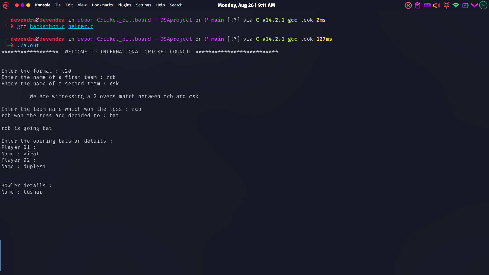
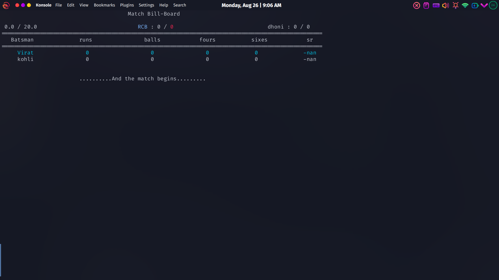
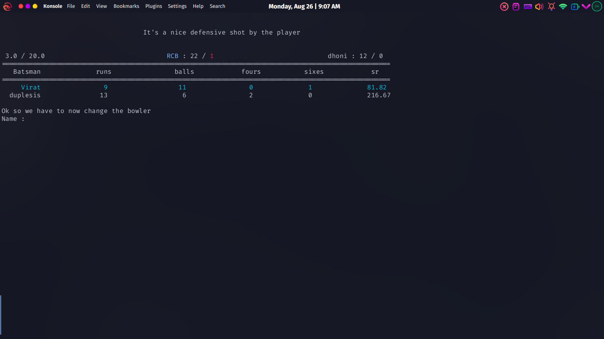
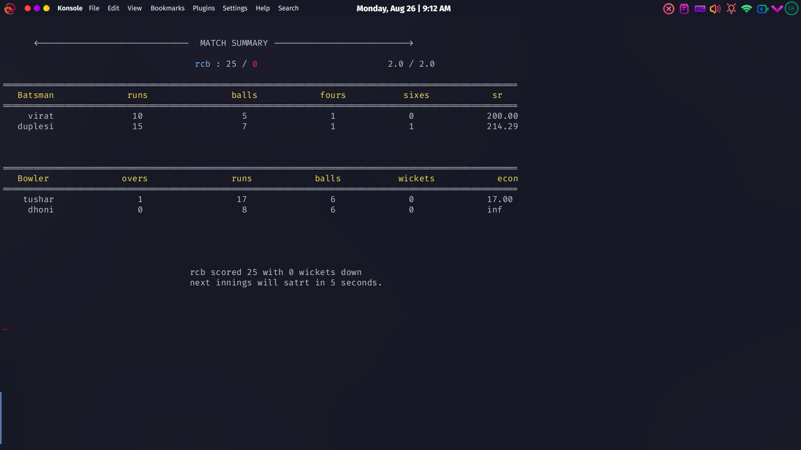
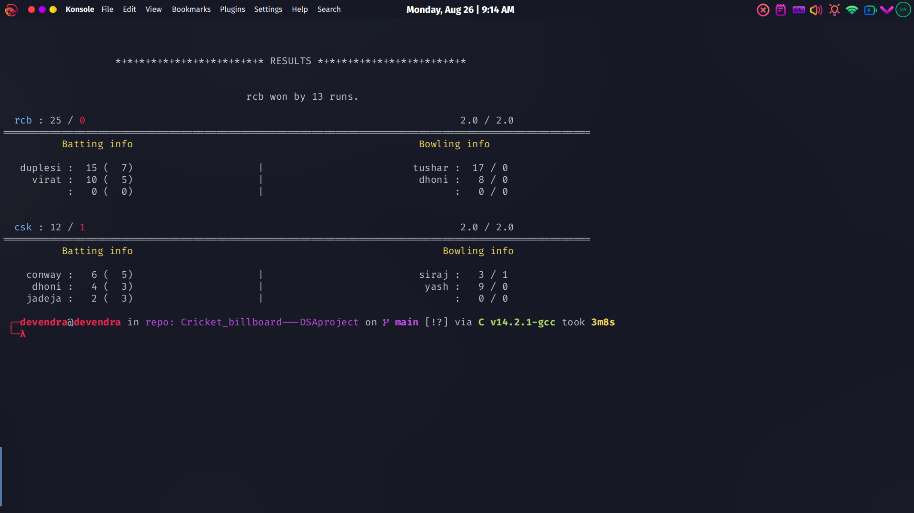

# Cricket_billboard---DSAproject
This repo contains a DSA ( Data structures ) project which represents a dyanamic cricket billboard.
This uses a simple data structures such as structures,arrays and sorting and other algorithms.

To run the project copy and paste hackathon.c, header.h and helper.c file in single directory. Open the terminal and goto the directory which contain these files and run a command as
```gcc hackathon.c helper.c```
to compile it
and run

```./a.out```

to run it. The commands or for linux based system.

Specify the required details to start the match as



Then sit back and enjoy.
The match will run on it's own





